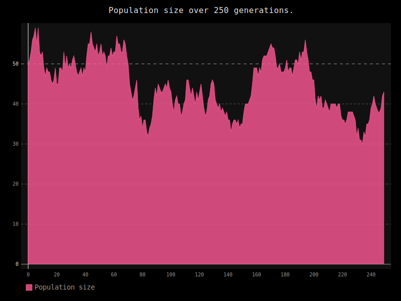

### Genome diversity model "SEED ROOT":

🔵🔴🔵
As part of the project, interactive behavior simulation of Bacteria.
[Try it out here!](https://bohdandrahan.github.io/Genome-diversity-model-Seed-Root/)

A simulation of genome diversity in different kinds of populations including asexual and sexual reproduction.

This model simulates behavior of population in closed environment.
Envierment is completely random wich means that chances of death of any given two specimens are equal.

## Asexual reproduction.

## Sexual reproduction.

## Increasing of homogeneity of populaiton in closed environment over time.

