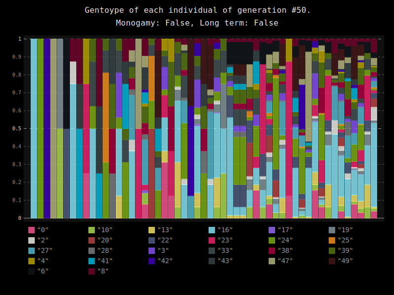
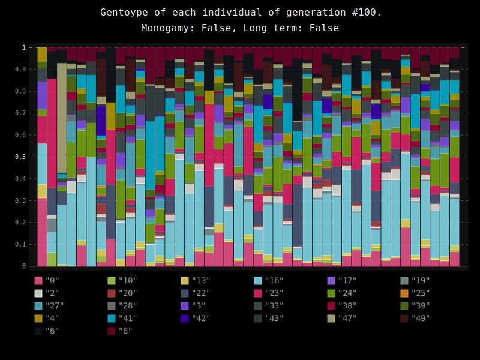
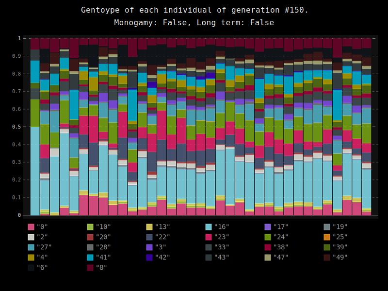

### Genome diversity model "SEED ROOT":

A simulation of genome diversity in different kinds of populations including asexual and sexual reproduction.

This model simulates behavior of population in closed environment. 

## Asexual reproduction.

## Sexual reproduction.

## Increasing of homogeneity of populaiton in closed environment over time.

